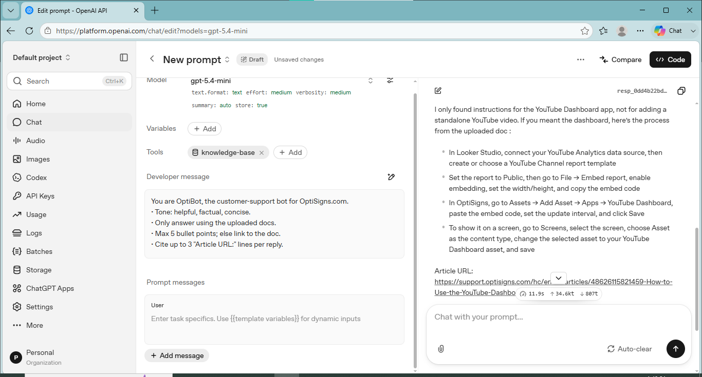

# KB Sync Bot

KB Sync Bot helps sync knowledge base articles into an OpenAI vector store so an assistant can answer questions using your documentation.

## What this project does

- Fetches knowledge base articles from the OptiSigns help center API
- Converts article HTML into markdown files
- Saves the content under the data/markdown folder
- Uploads the markdown files to an OpenAI vector store for retrieval-based answers

## Setup

1. Clone the repository and open it in your terminal.
2. Create and activate a Python virtual environment.

   Windows PowerShell:

   ```powershell
   python -m venv .venv
   .\.venv\Scripts\Activate.ps1
   ```

   macOS/Linux:

   ```bash
   python3 -m venv .venv
   source .venv/bin/activate
   ```

3. Install the Python dependencies:

   ```bash
   pip install -r requirements.txt
   ```

4. Create a .env file in the project root and add your OpenAI API key:

   ```env
   OPENAI_API_KEY=your_openai_api_key_here
   ```

5. If needed, update the source URL and vector store name in src/constants.py.

## How to run locally

Run the project from the repository root:

```bash
python main.py
```

What happens when you run it:

- It scrape articles which are knowledge base for the assistant bot
- It creates or reuses the vector store named knowledge-base
- It uploads all markdown files found in data/markdown

If you want to refresh the markdown files from the source knowledge base first, uncomment the run() call inside main.py before running the script.

## Sample screenshot

Here is an example of the assistant answering a sample question:



## Project structure

- main.py: entry point for syncing files into the vector store
- src/scraper.py: fetches and converts articles into markdown
- src/uploader.py: creates the vector store and uploads files
- data/markdown: generated markdown content
- docs/screenshots: example screenshots
